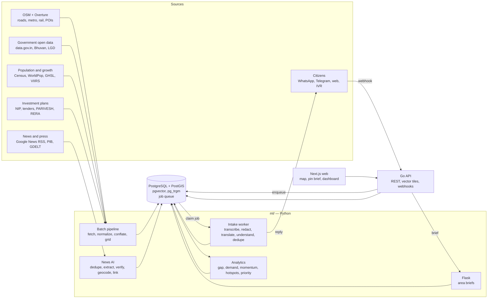
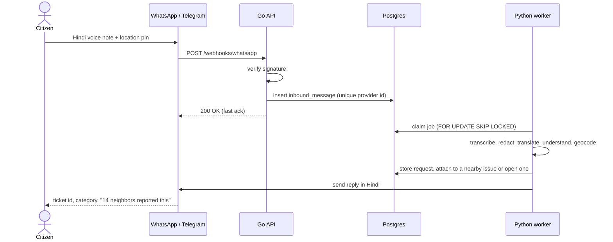

# INFRA-AI

**Pin any place in India. See what was built, what is being built, what is coming — and what the people who live there are asking for.**

A multilingual, location-first infrastructure intelligence platform, designed as a Digital Public Good (DPG).

> **Status:** planning — no code yet. This README is the master plan.
> Why each decision was made: [`docs/adr/`](docs/adr/README.md) · How to work in this repo (humans and AI agents): [`AGENTS.md`](AGENTS.md) · Step-by-step workflows: [`.claude/skills/`](.claude/skills/) · Field plans: [`docs/fields/`](docs/fields/README.md)
> Team research already in the repo: [India_Existing_Project_Gaps.md](India_Existing_Project_Gaps.md) (where existing systems fall short, with audit evidence) · [LokDristi_Datasets.md](LokDristi_Datasets.md) (dataset catalog and LGD join architecture). Where they differ from this plan: [§18](#18-open-questions-and-assumptions).

**Contents:** [0 TL;DR](#0-tldr) · [1 Problem](#1-problem-and-our-angle) · [2 Users](#2-users-and-what-they-get) · [3 PS coverage](#3-problem-statement-coverage) · [4 Data scope](#4-data-scope-what-we-build-first) · [5 Sources](#5-data-sources) · [6 Architecture](#6-architecture) · [7 Data model](#7-data-model) · [8 Pipelines and analytics](#8-pipelines-and-analytics) · [9 Product and demo](#9-product-surfaces-and-demo) · [10 API](#10-api) · [11 Stack](#11-tech-stack) · [12 Layout](#12-repository-layout) · [13 Build plan](#13-build-plan) · [14 Evaluation](#14-evaluation) · [15 DPG and privacy](#15-digital-public-good-privacy-and-responsible-ai) · [16 Risks](#16-risks-and-mitigations) · [17 Scaling](#17-scaling-to-all-of-india) · [18 Open questions](#18-open-questions-and-assumptions) · [19 Working here](#19-working-on-this-repo) · [A Config](#appendix-a-config-examples) · [B Glossary](#appendix-b-glossary)

---

## 0. TL;DR

- **The gap.** Information about the infrastructure around any place in India is scattered across maps, dozens of agency websites and PDFs, tender portals, press releases, news in many languages, and siloed grievance portals. Nobody — citizen, official or investor — can see one location's past, present and future in one place, or check it against what residents actually need.
- **The product.** Drop a pin and get: what exists (roads, flyovers, metro, rail, airports, hospitals, schools — public and private); what changed over 20+ years; what is under construction, approved or announced (extracted from news, press releases and tenders — every claim cited); what residents are asking for (voice, text or WhatsApp, in their own language); and a gap, priority and growth outlook.
- **For policymakers.** Statistically significant demand and gap hotspots, ranked project recommendations with evidence, a spending-vs-need misalignment view, and before/after impact tracking.
- **How.** Every source is joined on one H3 hexagon grid in PostgreSQL/PostGIS. Transparent indices (Access Gap, Citizen Demand, Growth Momentum, Priority) plus Getis-Ord Gi* hotspots. **No predictive model** — LLMs only read and structure text and write cited summaries.
- **Scope.** Field by field, all of India: national highways and metro rail first, each owned end to end — data → EDA → geospatial analysis → findings → map layers. Railways, airports, water (canals) and more follow the same template. A new city is one config file.
- **DPG-ready.** Open source, open data exports, open standards (Open311, vector tiles, LGD codes), swappable AI providers, DPDP-aligned privacy.

## 1. Problem and our angle

**The problem statement, condensed.**

- Citizen development requests live in fragmented systems, across many languages.
- Public spending drifts away from need; infrastructure gaps stay unaddressed.
- There is no way to measure the impact of large-scale public infrastructure initiatives.
- **The ask:** a scalable, multilingual AI platform (a DPG) that collects requests by voice, text and messaging apps, analyzes them together with demographic data, infrastructure indices and public investment plans, surfaces demand hotspots and recommends high-priority projects to national policymakers.

**What "scattered" looks like today.** Try answering: *"What is happening to infrastructure around Hebbal, Bengaluru, and what is coming in the next two years?"*

| Where you would look | What it tells you | What it does not |
|---|---|---|
| Map apps, OpenStreetMap | What exists now | History, plans, status |
| Agency sites (metro rail corporation, NHAI, development authority, municipal corporation) | That agency's projects, often as PDFs | Anything outside that agency; a common map |
| Tender and clearance portals (CPPP, state e-procurement, PARIVESH) | Early signals, months before construction | Plain-language meaning; a location on a map |
| Press releases (PIB, state information departments) and news in many languages | Announcements, delays, cost revisions | Reliability, deduplication, a timeline |
| Grievance portals (CPGRAMS, municipal apps) | Individual complaints | Aggregated demand; links to planned works |
| Census, WorldPop, satellite data | Who lives there, how built-up it is | Links to any of the above |

**Our angle: location-first.** Join every dataset by place and time, so that one pin answers five questions:

1. **What's here?** Existing infrastructure, public and private.
2. **What changed?** Completed projects, built-up growth and night-light growth over 20+ years.
3. **What's coming?** Under construction, approved or announced — with confidence and sources, bucketed into 0–2 years, 2–5 years and uncertain.
4. **What do people need?** Citizen requests in any language, deduplicated into issues.
5. **So what?** Gap and priority for policymakers; a growth outlook for citizens and investors.

## 2. Users and what they get

| Persona | Their question | What they get | Channel |
|---|---|---|---|
| **Citizen** — any language, voice-first, often on a low-end phone | "Our lane floods every monsoon — will anyone fix it? What is being built near us?" | Report a need by voice or text with a location; a ticket in their language; "N neighbors reported this"; a spoken or written brief of what is coming nearby; updates when a linked project moves | WhatsApp, Telegram, web app, IVR (stretch) |
| **Policymaker / planner** — ministry, state, district, city, ward | "Where are the unmet needs, and is money going to the right places?" | Hotspots, ranked recommendations with evidence, misalignment view, silent gaps, impact tracker, exports | Web dashboard, API |
| **Investor, homebuyer, journalist, researcher** | "Is this area about to grow? What is delayed?" | Pin → timeline, pipeline with confidence, growth momentum with its drivers, sources | Web map, API |

The growth outlook is informational, never investment advice ([§15](#15-digital-public-good-privacy-and-responsible-ai)).

## 3. Problem statement coverage

| The PS asks for | How we deliver | Where |
|---|---|---|
| Scalable | Every field covers all of India from day one; a new field follows one template (`docs/fields/`); a new city is configuration; multi-resolution H3 rollups | §4, §17, ADR-0013 |
| Multilingual | 22 scheduled languages via Bhashini / AI4Bharat; code-mixed and romanized input handled | §8.5, ADR-0009 |
| Digital Public Good | DPG Standard met indicator by indicator | §15, ADR-0011, ADR-0012 |
| Requests via voice, text and messaging apps | WhatsApp, Telegram, web app with microphone, IVR (stretch) | §8.5, ADR-0010 |
| Analyze feedback + demographics + infrastructure indices + investment plans together | One H3 grid joins requests, Census/WorldPop, computed access indices and NIP / tenders / news | §7, §8.3 |
| Surface demand hotspots | Getis-Ord Gi* on demand, gap and growth, FDR-corrected | §8.3 |
| Recommend high-priority projects to policymakers | Priority = demand × gap × people affected, discounted where a project is already planned — each with rationale and evidence | §8.3 |
| Fix misaligned spending | Share of need vs share of planned investment, per ward and district | §8.3 |
| Measure the impact of large initiatives | Before/after tracker around completed projects | §8.3 |

## 4. Data scope: what we build first

Decided in [ADR-0013](docs/adr/0013-field-first-scope.md), which supersedes the earlier T-shaped scope ([ADR-0001](docs/adr/0001-t-shaped-data-scope.md)).

**Field by field, all of India.** A *field* is one type of infrastructure, covered nationally and owned end to end by one person: sources → canonical data → EDA → geospatial analysis → findings → map layers and API → a cited pipeline of its projects. Two fields first; the next starts when both meet the done bar in [`docs/fields/`](docs/fields/README.md).

| # | Field | Owner | Covers | Plan |
|---|---|---|---|---|
| 1 | **National Highways** | Punya | NH network incl. expressways, lanes, toll plazas; NH pipeline incl. land-acquisition notifications; safety | [national-highways.md](docs/fields/national-highways.md) |
| 2 | **Metro rail** | Data teammate | Metro, RRTS and monorail: lines, stations, pipeline, ridership, station catchments, TOD zones | [metro-rail.md](docs/fields/metro-rail.md) |
| Next | Railways · airports · water (canals, irrigation) · health · education | — | One at a time, same template — skill [`add-field`](.claude/skills/add-field/SKILL.md) | — |

**Team:** two people on the UI, two on data (one per field). Shared parts — H3 grid and population, growth layers (GHSL, VIIRS, Open Buildings), news AI, the pin API and brief — are built once and reused by every field.

**Why not every layer for two cities:** two data people cannot clean a dozen layers well. Field-first finishes something real, covers the whole country from day one, and makes "add a field" the scaling story ([§17](#17-scaling-to-all-of-india)).

**Showcase cities for the demo (proposed): Bengaluru and Lucknow** — both have metro lines and highway or expressway activity, so the pin story works for both fields. They no longer bound the data.

| | Bengaluru | Lucknow |
|---|---|---|
| Profile | Tier-1 metro, fast peripheral growth | Tier-2 state capital |
| Languages | Kannada, English, Hindi | Hindi, Urdu, English |
| Why | Dense OSM; an active civic open-data community (OpenCity, DataMeet); many live projects — metro phases, suburban rail, ring roads, the airport corridor — so a rich news layer | Expressway hub with metro and a ring road; Hindi-heavy intake; a Tier-2 contrast |

Swap-ins if the team knows another city better: Pune (Marathi), Hyderabad (Telugu), Ahmedabad (Gujarati), Indore (Hindi). A swap costs one config file.

**Backlog for later fields**

| Group | Layers |
|---|---|
| Transport | Railways (lines, stations), airports, bus terminals, state highways and ring roads, flyovers and rail over-bridges |
| Water | Canals and irrigation, water and sewage treatment plants |
| Social | Hospitals and health centers, schools and colleges, police and fire stations, parks |
| Economic and private | IT parks and SEZs, industrial areas, malls, RERA-registered real-estate projects |
| Shared context (built once) | Wards, LGD districts, population grid, built-up history, night lights, land use |

## 5. Data sources

Every record keeps `source`, `source_ref`, `fetched_at` and `license`. Licenses are checked **before** ingesting — see skill [`add-data-source`](.claude/skills/add-data-source/SKILL.md).

| Layer | Source | License / terms | Used for |
|---|---|---|---|
| Roads, flyovers, metro, rail, POIs — incl. `construction` / `proposed` tags | [OpenStreetMap](https://www.openstreetmap.org) via the [Geofabrik India extract](https://download.geofabrik.de/asia/india.html); Overpass API for quick city pulls | ODbL | Existing and under-construction assets |
| POIs, buildings, transport | [Overture Maps](https://docs.overturemaps.org) GeoParquet, read by bounding box with DuckDB | CDLA-Permissive-2.0 / ODbL (per theme) | Conflation; private infrastructure |
| Building footprints over time | [Google Open Buildings](https://sites.research.google/open-buildings/), incl. the 2.5D temporal dataset | CC BY 4.0 or ODbL | New-construction signal |
| Built-up history, 1975–2020 epochs | [GHSL](https://human-settlement.emergency.copernicus.eu) (EC JRC) | CC BY 4.0 | "What changed" timeline |
| Night-time lights, 2012 onward | [VIIRS nighttime lights](https://eogdata.mines.edu/products/vnl/) (Earth Observation Group) | CC BY 4.0 | Economic-activity growth |
| Population | [WorldPop](https://www.worldpop.org) 100 m grids; [Census of India 2011](https://censusindia.gov.in) ward-level tables | CC BY 4.0; GODL-India | Per-capita rates; people affected |
| Boundaries and codes | Survey of India–compliant national/state outlines; [LGD codes](https://lgdirectory.gov.in); [DataMeet maps](https://github.com/datameet/maps) and [municipal wards](https://github.com/datameet/Municipal_Spatial_Data); [OpenCity](https://data.opencity.in) | Per dataset | Aggregation, drill-down, joins |
| Health and schools | [data.gov.in](https://data.gov.in) hospital directory, NHRR, UDISE+ | GODL-India | Gap analysis |
| Airports | [OurAirports](https://ourairports.com/data/), Airports Authority of India | Public domain | Backbone |
| Land use | [Bhuvan](https://bhuvan.nrsc.gov.in) (NRSC/ISRO) land-use/land-cover WMS | Bhuvan terms | Context |
| Public investment plans | National Infrastructure Pipeline via [India Investment Grid](https://indiainvestmentgrid.gov.in); Union and state budgets; city project lists (Smart Cities, AMRUT) | GODL-India / site terms | Pipeline; misalignment |
| Early signals | [CPPP e-tenders](https://eprocure.gov.in) and state e-procurement; [PARIVESH](https://parivesh.nic.in) clearances; state RERA portals | Public records — respect robots.txt and terms | "What's coming", before the news covers it |
| News and announcements | Google News RSS (city × infrastructure × language queries) for discovery; [PIB](https://pib.gov.in) releases; [GDELT](https://www.gdeltproject.org) | Store metadata, a short quote and the link only | Project timelines |
| Citizen requests | Our intake channels; a labeled synthetic seed set for the demo; public grievance dumps where published | Own data, with consent | Demand |
| Indices | MoHUA Ease of Living Index, NITI Aayog SDG Urban India Index, NFHS-5 district indicators | GODL-India | Context and validation |
| Price sanity check | RBI House Price Index, NHB RESIDEX (city level) | Site terms | City-level check of momentum only — never micro-location claims |
| Integration target | PM GatiShakti National Master Plan — government login; the 2025–26 Union Budget announced private-sector access, and "GatiShakti Public" (Oct 2025) offers about 230 datasets after registration, view and analysis only | Restricted | Ask the organizers for access |

Census 2011 is the latest published census; swap in Census 2027 figures when they are released.

Rural and sector depth — MPLADS works (a direct misalignment signal), Mission Antyodaya village infrastructure, JJM, SBM-G, MGNREGA, PMAY, HMIS, the ABDM Health Facility Registry — and a real municipal grievance dataset (PCMC 2025 on data.gov.in) are cataloged in [LokDristi_Datasets.md](LokDristi_Datasets.md).

## 6. Architecture

Decided in [ADR-0005](docs/adr/0005-postgres-single-datastore.md), [ADR-0006](docs/adr/0006-three-service-monorepo.md), [ADR-0007](docs/adr/0007-open-map-stack.md) and [ADR-0008](docs/adr/0008-llm-boundary.md).



| Component | Tech | Responsibility |
|---|---|---|
| `web/` | Next.js (App Router), TypeScript, Tailwind, MapLibre GL JS | Map, pin panel, policy dashboard; server components call the API |
| `api/` | Go — stdlib `net/http`, pgx, sqlc | The only public entry point: REST API (OpenAPI 3.1), vector tiles, messaging webhooks, dashboard auth |
| `ml/` | Python — Flask, GeoPandas, DuckDB, PySAL | Batch pipeline, analytics, news AI, intake worker, EDA notebooks; Flask serves the one synchronous AI call (area briefs) |
| Database | PostgreSQL + PostGIS + pgvector + pg_trgm | Single source of truth, and the job queue |

**Why it is this lean**

- One database does geometry, fuzzy place search, vectors and the job queue — no Kafka, Redis, Elasticsearch or separate vector DB until a measurement says otherwise.
- Vector tiles come straight from PostGIS (`ST_AsMVT`) — no tile server.
- Batch wherever possible (nightly news, nightly scores); real time only where a person is waiting (chat replies, pin briefs).
- Webhooks persist first, acknowledge fast and process asynchronously — no message is lost when the AI service is down.
- Every AI output stores its evidence, model and prompt version, so it can be audited.
- Each AI capability sits behind one function, with the provider chosen by an environment variable — an open-weights model can replace any hosted one (DPG platform independence).
- Graceful degradation: if the brief service is down, a pin still shows every fact — just without the narrative.

## 7. Data model

Decided in [ADR-0004](docs/adr/0004-h3-grid-spatial-key.md).

- Geometry in EPSG:4326; provenance and confidence on every row.
- Per-source staging tables (`raw_<source>`) upsert on `(source, source_ref)`; conflation then writes the canonical tables below.
- Infrastructure lifecycle: `proposed → approved → tendered → under_construction → operational`, plus `stalled` and `cancelled`. A project at the DPR stage counts as `proposed`.
- Analysis grid: H3 resolution 8 (≈0.74 km² hexagons) inside cities; resolution 5–7 rollups for state and national views; wards and districts (LGD codes) for policy reports.

```sql
CREATE EXTENSION IF NOT EXISTS postgis;
CREATE EXTENSION IF NOT EXISTS vector;
CREATE EXTENSION IF NOT EXISTS pg_trgm;

CREATE TYPE lifecycle AS ENUM
  ('proposed', 'approved', 'tendered', 'under_construction', 'operational', 'stalled', 'cancelled');

-- A tracked development effort (from NIP/IIG, tenders, clearances, budgets, news)
CREATE TABLE project (
  id                  bigint GENERATED ALWAYS AS IDENTITY PRIMARY KEY,
  city_id             text NOT NULL,                 -- 'national' for backbone projects
  name                text NOT NULL,
  kind                text NOT NULL,                 -- metro_line, flyover, ring_road, hospital, ...
  agency              text,
  stage               lifecycle NOT NULL,
  cost_crore          numeric(14, 2),
  expected_completion date,
  geom                geometry(Geometry, 4326),      -- NULL until geocoded
  geom_precision      text CHECK (geom_precision IN ('exact', 'corridor', 'locality', 'city')),
  confidence          real NOT NULL CHECK (confidence BETWEEN 0 AND 1)
);

-- What physically exists or is being built, public or private
CREATE TABLE asset (
  id          bigint GENERATED ALWAYS AS IDENTITY PRIMARY KEY,
  city_id     text NOT NULL,
  category    text NOT NULL,                         -- transport | health | education | utility | economic
  kind        text NOT NULL,
  name        text,
  status      lifecycle NOT NULL,
  ownership   text NOT NULL DEFAULT 'unknown'
              CHECK (ownership IN ('public', 'private', 'ppp', 'unknown')),
  opened_on   date,
  geom        geometry(Geometry, 4326) NOT NULL,
  sources     jsonb NOT NULL,                        -- [{source, source_ref, fetched_at, license}]
  confidence  real NOT NULL CHECK (confidence BETWEEN 0 AND 1),
  project_id  bigint REFERENCES project (id)
);
CREATE INDEX ON asset USING gist (geom);
CREATE INDEX ON asset (kind, status);

-- Evidence trail: every stage claim points at a source and a verbatim quote
CREATE TABLE project_event (
  id          bigint GENERATED ALWAYS AS IDENTITY PRIMARY KEY,
  project_id  bigint NOT NULL REFERENCES project (id),
  stage       lifecycle NOT NULL,
  event_date  date NOT NULL,
  source_type text NOT NULL
              CHECK (source_type IN ('news', 'press_release', 'tender', 'clearance', 'budget', 'rera', 'dataset')),
  source_url  text NOT NULL,
  language    text NOT NULL,                         -- BCP-47
  evidence    text NOT NULL,                         -- verbatim quote, verified against the source text
  extractor   text NOT NULL,                         -- model id + prompt version, or 'manual:<reviewer>'
  confidence  real NOT NULL CHECK (confidence BETWEEN 0 AND 1),
  UNIQUE (project_id, source_url, stage)
);

-- A deduplicated civic issue ("14 neighbors reported this")
CREATE TABLE issue (
  id          bigint GENERATED ALWAYS AS IDENTITY PRIMARY KEY,
  category    text NOT NULL,
  geom        geometry(Point, 4326) NOT NULL,
  status      text NOT NULL DEFAULT 'open' CHECK (status IN ('open', 'planned', 'resolved')),
  project_id  bigint REFERENCES project (id)         -- set when a project addresses it
);
CREATE INDEX ON issue USING gist (geom);

-- One processed citizen message. PII-redacted; contact details are never stored here.
CREATE TABLE citizen_request (
  id             bigint GENERATED ALWAYS AS IDENTITY PRIMARY KEY,
  channel        text NOT NULL CHECK (channel IN ('whatsapp', 'telegram', 'web', 'ivr', 'sms')),
  channel_msg_id text NOT NULL,                      -- provider message id: webhook retries stay idempotent
  reporter_hash  text NOT NULL,                      -- HMAC of phone/user id: rate limits, distinct counts, no raw PII
  request_type   text NOT NULL CHECK (request_type IN ('new_facility', 'repair', 'service')),
  language       text NOT NULL,                      -- BCP-47, e.g. hi, kn, hi-Latn
  text_original  text NOT NULL,                      -- redacted transcript or text
  text_en        text NOT NULL,
  category       text NOT NULL,
  urgency        smallint NOT NULL CHECK (urgency BETWEEN 1 AND 5),
  geom           geometry(Point, 4326),
  geom_precision text NOT NULL CHECK (geom_precision IN ('pin', 'landmark', 'locality', 'unknown')),
  issue_id       bigint REFERENCES issue (id),
  embedding      vector(384),
  created_at     timestamptz NOT NULL DEFAULT now(),
  UNIQUE (channel, channel_msg_id)
);

-- Analytics per hexagon, rebuilt by the pipeline, versioned by snapshot
CREATE TABLE cell_score (
  h3          text NOT NULL,                         -- H3 cell id (res 8 in cities)
  snapshot    date NOT NULL,
  city_id     text NOT NULL,
  geom        geometry(Polygon, 4326) NOT NULL,
  population  real,
  access_gap  real,                                  -- 0..1
  demand      real,                                  -- smoothed, urgency-weighted requests per 1,000 residents
  momentum    real,                                  -- 0..100, percentile within the city
  priority    real,                                  -- 0..100
  by_category jsonb NOT NULL,                        -- per-category demand, gap and priority
  hotspots    jsonb NOT NULL,                        -- {"demand": "hot_99", "gap": "ns", "momentum": "hot_95"}
  drivers     jsonb NOT NULL,                        -- top contributing factors: powers every "why?"
  PRIMARY KEY (h3, snapshot)
);
CREATE INDEX ON cell_score USING gist (geom);

-- Also: raw_<source> staging tables, ingest_error, news_article, inbound_message (the queue),
-- contact (opt-in only, encrypted, retention-limited), boundary.
```

## 8. Pipelines and analytics

### 8.1 Ingestion and conflation

1. **Fetch** into `data/raw/<source>/<date>/` (immutable) and commit a manifest (URL, time, checksum, license, row count).
2. **Normalize:** each loader maps source tags to canonical kinds through `config/taxonomy.yaml` — mappings never live in code.
3. **Validate, fail closed:** invalid geometry, a point outside India, missing required fields → `ingest_error` with a reason. Nothing is dropped silently.
4. **Conflate:** same kind + within a distance threshold + similar name (trigram) → one `asset` that keeps every source reference.
5. **Grid:** attach H3 cells; clip to city boundaries.
6. **Idempotent:** every step can re-run without duplicating anything.

Example mappings (the full list lives in `config/taxonomy.yaml`):

| OSM tags | Canonical kind, status |
|---|---|
| `amenity=hospital` or `healthcare=hospital` | `hospital`, operational |
| `railway=station` + `station=subway` | `metro_station`, operational |
| `railway=construction` + `construction=subway` | `metro_line`, under construction |
| `highway=construction` / `highway=proposed` | road, under construction / proposed |
| Major `highway` + `bridge=yes` + `layer≥1`, not crossing a waterway, longer than 150 m | `flyover` (`rob` if it crosses a railway) — a heuristic, checked in EDA |
| `aeroway=aerodrome` with an IATA code | `airport` |

### 8.2 Exploratory data analysis

EDA comes before any scoring: it tells us what the scattered data can support. Each field has its own notebooks in `ml/notebooks/<field>/`, listed in its plan under [`docs/fields/`](docs/fields/README.md); the notebooks below are the cross-field ones.

| Notebook | Questions it answers | Feeds |
|---|---|---|
| `01_inventory` | What do we have, per layer, source and city? Counts, coverage maps, missing attributes, date ranges | Coverage report, §5 |
| `02_conflation` | How much do OSM, Overture and government directories overlap or disagree? Position offsets, name mismatches, merge precision | Conflation thresholds |
| `03_access` | Distance-to-nearest distributions per service; facilities per capita per ward; inequality of access (Gini / Lorenz across the population) | Access Gap norms and weights |
| `04_growth_history` | Where did built-up area and night lights grow? What happened around anchor projects (within 1 km vs 2–5 km, before vs after)? | Momentum's "past" term; Outlook evidence cards |
| `05_news_corpus` | Volume by language, source and time; projects mentioned; stage mix; delays; extraction quality | News AI tuning; stalled-project list |
| `06_requests` | Category × language × channel; time patterns; exploratory spatial clusters (HDBSCAN); demand vs gap correlation | Taxonomy; dedup thresholds |
| `07_sensitivity` | Do the top recommendations survive ±20 % weight changes? | Scoring sign-off |

Notebooks import functions from `ml/` — no logic lives only in a notebook. Each exports an HTML report to `ml/notebooks/reports/`, which doubles as pitch material.

### 8.3 Analytics model — explainable, no prediction

Decided in [ADR-0003](docs/adr/0003-explainable-analytics-no-prediction.md). Every parameter lives in `config/scoring.yaml` ([Appendix A](#appendix-a-config-examples)), and every score row stores its top `drivers`, so the UI can always answer "why?".

**Access Gap** — how far a hexagon is from essential services, relative to a norm.

```text
d(c,k)       = distance from the center of hex c to the nearest operational facility of kind k
               (v1: straight line × detour factor; v2: street network via pandana or OSRM)
gap(c,k)     = clamp((d(c,k) − norm_k) / norm_k, 0, 1)      # 0 = within the norm, 1 = twice the norm or worse
AccessGap(c) = Σ_k w_k · gap(c,k)                           # weights sum to 1
```

Norms start from the URDPFI Guidelines (MoHUA, 2014). Version 2 adds capacity: beds or school seats per 1,000 residents in the catchment.

**Citizen Demand** — how much residents are asking for, per category, normalized fairly.

```text
raw(c,j)    = Σ over open issues i of category j in hex c:
              urgency_i · ln(1 + distinct_reporters_i) · 0.5^(age_i / half_life)
demand(c,j) = (raw(c,j) + m · cityRate_j) / (population_c / 1000 + m)
```

The log damps campaigns and duplicates; the half-life favors recent reports; the prior `m` pulls tiny-population hexagons toward the city rate, so three reports from 30 residents do not top the list.

**Growth Momentum** — where development is concentrating. A leading-indicator score, not a forecast.

```text
Past(c)     = mean percentile of: Δ built-up share 2000→2020 (GHSL), Δ night-light radiance 2014→latest (VIIRS),
              new buildings 2016→2023 (Open Buildings)
Pipeline(c) = Σ over projects p: stage_weight(p) · weight_kind(p) · exp(−distance(c,p) / λ_kind(p))
Momentum(c) = city percentile of (0.4 · Past(c) + 0.6 · percentile(Pipeline(c)))      # 0–100
```

Stage weights run from 0.2 (proposed) to 0.9 (under construction) and 1.0 (opened in the last 3 years); stalled projects drop to 0.1. Reach λ runs from about 0.8 km for a metro station to 10 km for an airport.

**Hotspots** — Getis-Ord Gi* (PySAL `esda`) over the H3 grid; neighbors = the ring of 6 adjacent cells; 999 permutations; Benjamini–Hochberg FDR correction. Classes: hot or cold at 99 / 95 / 90 % confidence, otherwise not significant.

- on **Momentum** → *growth hotspots* — where infrastructure is concentrating
- on **Demand** → *demand hotspots* — where residents are asking
- on **Access Gap** → *gap hotspots* — where services lag

**Priority** — the recommendation engine for policymakers.

```text
Priority(c,j) = 100 · (0.35·pct(demand) + 0.35·pct(gap_j) + 0.20·pct(population) + 0.10·pct(severity))
                    · (1 − 0.8 · covered(c,j))
covered(c,j)  = highest stage_weight among approved-or-later projects of a matching kind within reach, else 0
```

`gap_j` is the gap for the service that matches category *j* (health → hospitals and health centers; education → schools; transit → stations and bus stops). Categories without a facility layer (drainage, water) drop the gap term and renormalize the weights. `severity` = the highest urgency plus related news signals (for example, repeated waterlogging reports). `new_facility` requests ("we need a school here") count directly. Adjacent top hexagons merge into a zone, and each zone becomes a card:

> **Grade-separated crossing on \<NH\> near \<village\>** — about 38,000 residents within 2 km, split by a 2-lane undivided highway · 64 underpass requests in 90 days · 5 fatal crashes reported in 2 years · no approved junction improvement within 5 km · *evidence links*
> Drivers: demand 0.95 · severity 0.93 · gap 0.88 · population 0.71
>
> *(Illustrative, not real data.)*

Category → intervention mappings (highway crossing → underpass or foot over-bridge, metro access → feeder bus route or station footpaths, drainage → stormwater drain, …) live in config.

**Silent gaps** — top 20 % Access Gap but bottom 40 % demand: underserved *and* unheard. Flagged for outreach (IVR drives, ward visits), so the loudest neighborhoods do not win by default.

**Misalignment** — per ward and district: share of total need (Σ priority) vs share of planned investment (Σ stage-weighted project cost). A scatter plot with the diagonal as "aligned", plus a ranked list of under-invested areas.

**Impact tracker** — for projects operational for at least 6 months: change in matching-category reports inside the catchment vs a control ring (λ to 2λ), 6 months before vs after — a descriptive difference-in-differences — plus the change in Access Gap.

**What infrastructure did to its neighborhood (retro analysis)** — for anchor projects completed between 2005 and 2018 (metro stations, flyovers, ring-road segments): built-up and night-light growth within 1 km vs a 2–5 km ring, before vs after. Results become evidence cards in the Outlook ("in this city, areas within 1 km of new metro stations grew X points faster over five years") — computed, never assumed.

### 8.4 News AI — "what's coming", with evidence

Decided in [ADR-0008](docs/adr/0008-llm-boundary.md).

1. **Discover** — per city: every spelling and script of the city name × infrastructure keywords per language, plus known project and agency names → Google News RSS, PIB, GDELT, agency press pages. Nationally: PIB cabinet approvals.
2. **Fetch and clean** — main text via `trafilatura`; keep URL, canonical URL, title, publish time, language and text hash. Full text is kept only for processing and deleted after a retention window; robots.txt is respected.
3. **Deduplicate** — canonical URL + near-duplicate text (MinHash) → story clusters; syndicated copies count once.
4. **Filter** — one cheap call: "Does this report a specific infrastructure project or event in \<city\>?"
5. **Extract** — LLM with a JSON schema (structured outputs), run nightly through the Batch API.
6. **Verify, in code, fail closed** — the evidence quote must appear in the article text (after normalizing whitespace and Unicode); dates must parse; stage and kind must be enum values. Anything else → review queue.
7. **Geocode** — place names against a gazetteer (OSM names, wards, landmarks; `pg_trgm`; limited to the city boundary), then Nominatim. Corridors ("from A to B via C") snap to OSM `proposed` / `construction` geometry when mapped; otherwise a line through the waypoints, marked `corridor` precision.
8. **Link** — match to existing projects by kind + name similarity + distance; an LLM tie-break only when ambiguous; otherwise create a project.
9. **Timeline** — the stage is the latest high-confidence event. A slipping completion date → "delayed" badge showing both sources. No progress for 12 months after "under construction" → "possibly stalled".
10. **Confidence** — from source type (official > news), number of independent sources, geocode precision and verification.
11. **Review** — confidence below 0.6 → review console (approve, edit, reject); every edit is logged.

Extraction output (illustrative, not real data):

```json
{
  "is_infrastructure_event": true,
  "projects": [
    {
      "name": "Example Nagar Flyover",
      "kind": "flyover",
      "agency": "Example Development Authority",
      "stage": "tendered",
      "stage_date": "2026-08-14",
      "expected_completion": "2028-03",
      "cost_crore": 212.5,
      "places": ["Example Nagar junction", "Outer Ring Road"],
      "evidence": "verbatim sentence from the article that states the stage",
      "language": "hi"
    }
  ]
}
```

Prompt rules: extract only what is stated; unknown → `null`; dates as written, never inferred; one entry per distinct project; evidence copied verbatim.

**Model and cost.** Default `claude-opus-5`, with `effort` tuned per route (low for the relevance filter, higher for extraction), structured outputs, and the Message Batches API for nightly work (half price, asynchronous). A 5,000-article pilot backfill costs roughly $50–150 (≈2k input + 0.4k output tokens per article, plus thinking). Moving a route to a cheaper model is a team decision backed by gold-set results ([§14](#14-evaluation)); the same function can call an open-weights model for sovereign deployments.

### 8.5 Citizen intake — voice, text, messaging, any language

Decided in [ADR-0009](docs/adr/0009-language-stack.md) and [ADR-0010](docs/adr/0010-citizen-intake.md).

| Channel | Why | Demo setup |
|---|---|---|
| WhatsApp Cloud API | India's most-used messaging app; voice notes, text and location pins | Meta test number (limited recipients) while business verification runs |
| Telegram bot | No business verification; same features | Main fallback for the demo |
| Web app (PWA) | Any phone browser; microphone via `MediaRecorder`, location via the Geolocation API | Ships with `web/` |
| IVR / missed call (stretch) | Feature phones, low literacy | Telephony provider → same queue |

Per message:

1. **Receive** — verify the webhook signature, store the raw message in `inbound_message` (unique provider message id), return 200 at once.
2. **Claim** — a worker takes the job (`FOR UPDATE SKIP LOCKED`); retries with backoff; dead-letter after 5 attempts.
3. **Transcribe** voice (Bhashini / IndicConformer; Whisper as fallback) and **identify the language**, including romanized text such as Hinglish (`hi-Latn`).
4. **Redact** phone numbers, emails and Aadhaar- or PAN-like numbers *before* any hosted model sees the text.
5. **Translate** to English (Bhashini / IndicTrans2), keeping the original.
6. **Understand** — one LLM call returns the request type (`new_facility`, `repair`, `service` or `question`), category, urgency 1–5, place mentions, and names to redact.
7. **Locate** — shared pin > landmark geocoded inside the city > ask the sender to share a pin.
8. **Deduplicate** — same category, within 300 m, embedding similarity ≥ 0.8 → attach to the existing issue; otherwise open a new one.
9. **Reply** in the sender's language (text, optionally voice): ticket id, category, "N neighbors reported this". Questions such as "what's coming near me?" get an area brief instead of a ticket and are not counted as demand.
10. **Follow up** — when a linked project changes stage, notify citizens who opted in.



Request categories (fixed, mapped to the responsible agencies): **highways** — crossings and underpasses · service roads · potholes and repairs · accident spots · tolls; **metro** — extensions and new stations · feeder and last-mile · station access and parking · crowding and frequency; **everything else** is kept for later fields, never dropped — local roads · drainage and flooding · water supply · sanitation · streetlights and power · health facility · school · public safety · other.

### 8.6 Pin → area brief

1. **Pin** — latitude, longitude and radius (default 3 km, adjustable 1–10 km).
2. **Gather facts** in SQL — assets by kind and status; projects with their evidence trails; issue counts by category (aggregates only); hexagon scores; built-up and night-light series. Each fact gets an id (F1 … Fn).
3. **Write** — the LLM drafts five sections — *What's here · What changed · What's coming (0–2 years, 2–5 years, uncertain) · What people need · Outlook and risks* — citing fact ids only.
4. **Validate, fail closed** — every sentence cites at least one existing fact, and every number in the text appears in the cited facts. On failure → regenerate once → otherwise serve a templated brief built without the LLM.
5. **Localize** — translate into the requested language (a glossary keeps project and place names intact); optional speech for voice replies.
6. **Cache** per (H3 cell of the pin, radius, language, data snapshot).

Example (illustrative, not real data):

> **What's coming (0–2 years).** A metro station 700 m north is under construction, expected in 2027 according to the operator's latest release [F12] and two news reports [F14, F15]. A ring-road segment 3.1 km east was tendered in August 2026 [F21].
> **What people need.** 38 reports in the last 90 days, mostly requests for a feeder bus and footpaths to the new station (21) [F30]; no feeder route is planned [F31].
> **Outlook.** Growth momentum 82/100 (city percentile), driven by the metro station and the ring road [F40]; risk: the station's completion date has slipped twice [F16]. *Informational, not investment advice.*

## 9. Product surfaces and demo

1. **Explore map** — layer toggles (transport, health, education, utilities, economic/private); status filter (existing, under construction, planned); hexagon overlays (gap, demand, momentum, priority); a time slider from 1975 to 2030 (built-up epochs and project dates); place search; "Drop a pin".
2. **Area panel** — tabs *Past · Present · Future · People · Outlook*; every item links to its source.
3. **Policy dashboard** — drill-down from nation to state, district, city and ward; hotspot map; ranked recommendations with driver bars and evidence; misalignment scatter; silent gaps; impact tracker; CSV and GeoJSON export.
4. **Citizen channels** — the WhatsApp / Telegram bot and the web "Report / Ask" page.
5. **Review console** — low-confidence extractions and geocodes: approve, edit or reject.

The interface ships in English, Hindi and Kannada first; strings live in per-language dictionaries.

**Three-minute demo**

| Time | Beat | On screen |
|---|---|---|
| 0:00 | The problem in one line; the "one pin" promise | Title over a collage of scattered sources |
| 0:20 | A villager near Lucknow sends a Hindi voice note with a location: "हाईवे पार करने के लिए अंडरपास चाहिए, रोज़ हादसे होते हैं" | Phone: Hindi reply with a ticket and "14 neighbors reported this" |
| 0:50 | The request lands on the NH layer, inside a demand hotspot on a 2-lane stretch | Map; the hexagon lights up |
| 1:10 | Policymaker view: NH recommendations — crossing #1 with drivers and evidence; national NH access-gap map; pipeline vs gap chart | Dashboard |
| 1:50 | Bengaluru: a pin near an upcoming metro station on the airport corridor; time slider 2000 → 2030; nearest NH and expressway pipeline; station catchment and TOD zone; cited news cards | Map and area panel |
| 2:30 | A Kannada question — "ನನ್ನ ಏರಿಯಾದಲ್ಲಿ ಮೆಟ್ರೋ ಯಾವಾಗ ಬರುತ್ತದೆ?" — gets a Kannada text and voice answer with the station's stage and expected date | Chat |
| 2:45 | Scale and DPG: "city #3 is one config file"; open exports; open standards | Config file and export button |

## 10. API

| Method | Path | Purpose |
|---|---|---|
| GET | `/v1/area?lat=&lon=&radius_km=` | Area profile: assets, projects, events, issue aggregates, scores |
| GET | `/v1/area/brief?lat=&lon=&radius_km=&lang=` | Cited AI brief (cached); `brief: null` plus a reason if the brief service is down |
| GET | `/v1/hotspots?city=&metric=` | Hotspot class per hexagon (`metric`: gap, demand, momentum or priority) |
| GET | `/v1/recommendations?city=&category=&limit=` | Ranked recommendations with drivers and evidence |
| GET | `/v1/projects?bbox=&stage=&kind=` | Projects with their current stage |
| GET | `/v1/projects/{id}` | One project with its full evidence trail |
| GET | `/v1/tiles/{layer}/{z}/{x}/{y}.mvt` | Vector tiles straight from PostGIS |
| POST | `/v1/requests` | A request from the web app (enters the same queue as chat messages) |
| POST | `/webhooks/whatsapp`, `/webhooks/telegram` | Messaging intake (signature-verified) |
| GET | `/v1/export/{dataset}.{format}` | Open, non-PII bulk exports (`geojson`, `csv`, `parquet`) |
| — | `/open311/v2/…` | Open311 GeoReport v2 compatibility (Should) |

Conventions: `api/openapi.yaml` is the contract, and the web client is generated from it; errors are `{"error": {"code": "...", "message": "..."}}`; cursor pagination; geometry as GeoJSON in EPSG:4326; rate limits on every public endpoint.

## 11. Tech stack

| Layer | Choice | Why |
|---|---|---|
| Web | Next.js (App Router), TypeScript, Tailwind CSS | Server components; team standard |
| Map | MapLibre GL JS; OpenFreeMap basemap for the demo, self-hosted Protomaps in production | Open source, no API keys, DPG-friendly; native heatmap and fill layers |
| Boundaries | Survey of India–compliant national and state outlines | Required for maps of India |
| API | Go — stdlib `net/http` routing, pgx, sqlc | Small and fast; typed SQL without an ORM |
| Pipeline and analytics | Python 3.12 — GeoPandas, DuckDB (spatial), h3-py, PySAL `esda`, trafilatura | Standard geo-data stack; DuckDB reads Overture GeoParquet by bounding box |
| AI serving | Flask, one synchronous endpoint (`/brief`) | Team standard for thin ML endpoints |
| Database | PostgreSQL + PostGIS + pgvector + pg_trgm | Geometry, vectors, fuzzy search and the queue in one store |
| Speech and translation | Bhashini; AI4Bharat IndicConformer (speech recognition), IndicTrans2 (translation), IndicXlit (transliteration), Indic Parler-TTS; Whisper as fallback | 22 scheduled languages; open models for self-hosting |
| LLM | Claude `claude-opus-5` behind one function per capability; structured outputs; Message Batches API; open-weights fallback | Strong multilingual extraction; swappable (DPG) |
| Embeddings | `intfloat/multilingual-e5-small` (384 dimensions) stored in pgvector | Multilingual; runs on CPU |
| Messaging | WhatsApp Cloud API, Telegram Bot API | Reach; free test paths |
| Operations | Docker Compose (local and self-hosted), GitHub Actions CI | Self-hostable, boring |

## 12. Repository layout

The context files exist now; everything marked with a milestone is created then.

```text
INFRA_AI/
├── README.md                    master plan (this file)
├── AGENTS.md                    rules for humans and AI agents working here
├── CLAUDE.md                    Claude Code entry point (imports AGENTS.md)
├── docs/adr/                    architecture decision records + template
├── docs/fields/                 one plan per field + the done bar + the shared layer contract
├── .claude/skills/              step-by-step workflows (add-data-source, onboard-city, …)
├── .github/                     PR template with the definition-of-done checklist
├── docker-compose.yml           postgres+postgis, api, ml, web                       (M0)
├── Makefile                     migrate, city, eval, test                            (M0)
├── config/
│   ├── cities/<city>.yaml       boundary, LGD codes, languages, news queries         (M0)
│   ├── fields/<field>.yaml      field parameters: distances, bands, H3 resolution    (M1)
│   ├── taxonomy.yaml            source tags → canonical kinds; request categories    (M0)
│   └── scoring.yaml             norms, weights, reach, stage weights                  (M2)
├── db/migrations/               plain SQL, numbered, forward-only                     (M0)
├── api/                         Go                                                    (M0)
│   ├── openapi.yaml             the contract
│   ├── cmd/api/main.go
│   └── internal/{http,tiles,webhook,store}/
├── ml/                          Python                                                (M1)
│   ├── app.py                   Flask: /brief, /healthz
│   ├── worker.py                queue worker: intake and news jobs
│   ├── ai/                      one module per AI capability + prompts/<capability>/vN.md
│   ├── fields/<field>/          field loaders and analyses (national_highways, metro_rail, …)
│   ├── pipeline/                shared: ingest_*, conflate, grid, scores, hotspots (CLI)
│   ├── eval/                    gold sets (JSONL) + evaluation runner
│   ├── notebooks/               <field>/NN_*.ipynb + cross-field 01–07; reports/ (HTML, committed)
│   └── tests/
├── web/                         Next.js App Router                                    (M0)
│   ├── app/                     explore map + pin panel; policy/ dashboard
│   ├── fixtures/<field>/        simplified GeoJSON samples from field owners (≤ 5 MB each)
│   └── lib/api/                 client generated from api/openapi.yaml
└── data/                        raw/ is gitignored; manifests/ is committed           (M1)
```

## 13. Build plan

Field-first ([ADR-0013](docs/adr/0013-field-first-scope.md)): each data owner takes one field end to end, two people build the UI against a fixed layer contract, and shared parts are built once.

**Team of four**

| Role | Owns | Starts on day one with |
|---|---|---|
| Field owner — National Highways (Punya) | NH sources, EDA, geospatial analysis, findings, NH layers and fixtures, NH pipeline events | OSM India extract filtered to NH + MoRTH state-wise NH length |
| Field owner — Metro rail (data teammate) | Metro sources, EDA, geospatial analysis, findings, metro layers and fixtures, metro pipeline events | OSM metro lines and stations + operator km and station counts |
| UI — explore | Map, layer toggles, status filter, pin → area panel, time slider | Fixtures in `web/fixtures/` + the layer contract in [`docs/fields/`](docs/fields/README.md) |
| UI — policy and citizen | Policy dashboard, recommendations view, citizen web app, i18n (en, hi, kn) | The same fixtures + the examples in `api/openapi.yaml` |

Shared work has named owners: the two field owners own `db/` and the shared pipeline (grid, population, growth layers, news AI); the UI pair owns `web/`. Owners for `api/` and citizen intake are settled at M0 ([§18](#18-open-questions-and-assumptions)).

**Milestones** — each one ends in something demoable.

| # | Milestone | Deliverables | Done when |
|---|---|---|---|
| M0 | Foundation | Repo skeleton, Docker Compose (PostGIS), migrations, taxonomy, layer contract, OpenAPI skeleton, UI shell on fixtures | The UI shows both fields' fixture layers on a map of India |
| M1 | Field data | Both fields' sources ingested, normalized and conflated; coverage reports vs official totals; real fixtures committed | NH and metro layers on the map with a status filter; coverage gap vs MoRTH / operator totals documented |
| M2 | Field analysis | EDA notebooks and geospatial metrics per field — access, catchments, pipeline gain, corridor and station effects | Each field plan has 5+ evidence-backed findings; access and gap overlays on the map |
| M3 | Pipeline and news | Projects and cited events for both fields — press releases, news, tenders, land-acquisition notifications; timelines and delay flags | A pin shows "What's coming" for both fields, every claim cited |
| M4 | Product | Pin → area panel for both fields; one recommendation type per field; citizen intake for transport categories | A Hindi voice note about an NH crossing appears on the map in under 30 s with a Hindi reply |
| M5 | Demo, then field #3 | Brief with validator, dashboard polish, demo script; start field #3 with skill `add-field` | The 3-minute demo runs end to end twice without intervention |

**Scope (MoSCoW)**

| Priority | Scope |
|---|---|
| **Must** | NH and metro fields done end to end (data, EDA, analysis, findings, layers, cited pipeline) · pin → area panel for both · one recommendation type per field (NH crossings or upgrades; metro catchment gaps) · citizen intake for transport categories in English, Hindi and Kannada, text and voice · policy dashboard |
| **Should** | Field #3 (railways, or water canals) · time slider · misalignment view · silent gaps · review console · open exports · Open311 endpoints |
| **Could** | IVR · voice replies · impact tracker · GTFS service-level analysis · toll analysis · TOD opportunity map · street-network access (pandana / OSRM) · photo attachments |
| **Won't (this round)** | Price or demand forecasting · parcel-level recommendations · Aadhaar or any identity integration · every field at once |

The layer contract in [`docs/fields/README.md`](docs/fields/README.md) and the OpenAPI spec are the contracts between the four roles, so nobody waits on anybody.

## 14. Evaluation

| What | Metric | Target |
|---|---|---|
| News extraction | Precision of (project, stage, date) on 150 hand-labeled articles in English, Hindi and Kannada | ≥ 0.80 |
| Geocoding | Share of locations within 1 km (points) or 2 km (corridors) of the truth | ≥ 0.75 |
| Request understanding | Category macro-F1 on 300 labeled messages across 3 languages, incl. voice and romanized text | ≥ 0.80 |
| Speech recognition | Word error rate on 50 real voice notes per language | Baseline recorded; a language stays text-only if poor |
| Issue deduplication | Precision on a sample of merges | ≥ 0.90 |
| Brief grounding | Sentences with valid citations; numbers matching facts | 100 % (enforced by the validator) |
| Hotspot face validity | Overlap with independently known problem areas (e.g., news-reported waterlogging spots) | Reported |
| Momentum retro-check | Momentum computed "as of 2015" from pre-2015 information only, vs built-up growth 2015→2020 (GHSL) and night-light growth 2015→latest; Spearman correlation against a distance-to-center baseline | Beats the baseline |
| Score robustness | Top-10 recommendations stable under ±20 % weight changes (1,000 draws) | ≥ 7 of 10 |
| Latency (p95) | Tiles · cached brief · uncached brief · chat reply | < 200 ms · < 300 ms · < 8 s · < 30 s |

Gold sets live in `ml/eval/` as versioned JSONL. Any prompt, schema or model change must match or beat them — see skill [`change-ai-pipeline`](.claude/skills/change-ai-pipeline/SKILL.md).

## 15. Digital Public Good, privacy and responsible AI

Decided in [ADR-0011](docs/adr/0011-privacy-do-no-harm.md) and [ADR-0012](docs/adr/0012-licensing-open-standards.md).

| DPG Standard indicator | How we meet it |
|---|---|
| 1. SDG relevance | SDG 9 (resilient infrastructure), SDG 11 (sustainable cities: transport access, participatory planning), SDG 16.7 (responsive, inclusive decision-making), SDG 10 (surfacing underserved areas) |
| 2. Open license | Apache-2.0 code; ODbL / CC BY 4.0 data; CC BY 4.0 docs |
| 3. Clear ownership | Named maintainers and a copyright notice in the repo |
| 4. Platform independence | An open alternative for every hosted dependency: LLM ↔ open-weights model; Bhashini ↔ self-hosted AI4Bharat models; WhatsApp ↔ Telegram / web / IVR; OpenFreeMap ↔ self-hosted Protomaps |
| 5. Documentation | README, AGENTS.md, ADRs, OpenAPI spec, data dictionary, model cards |
| 6. Data extraction | Bulk non-PII exports (GeoJSON, GeoParquet, CSV) plus the API |
| 7. Privacy and applicable laws | DPDP Act 2023: notice, consent, retention, erasure; Survey of India boundaries; source licenses honored |
| 8. Standards and best practices | OpenAPI 3.1, Open311, Mapbox Vector Tiles, GeoJSON / GeoParquet, LGD codes, BCP-47, ISO 8601, EPSG:4326 |
| 9. Do no harm by design | Redaction, hashing, role-based access, audit log; content moderation; aggregate-only public views; no parcel-level growth claims |

**Privacy (DPDP-aligned)**

- Notice and consent in the user's language at first contact; purpose limited to aggregating development needs.
- Phone numbers and user ids are stored only as an HMAC with a server secret. Raw contact details exist only for citizens who opt in to updates — encrypted, in a separate table, deleted 90 days after the issue closes or on request.
- Redaction happens before any hosted model sees the text, and again before storage.
- Public views show aggregates only; counts below 5 are suppressed at hexagon level; message text is never public. Policymakers see redacted text behind a login, with an audit log.
- No Aadhaar, no identity verification.

**Responsible AI**

- Every AI claim cites a source and shows its confidence; low confidence goes to human review.
- Growth outlooks are shown at hexagon or locality level — never per parcel — and labeled informational, to avoid fueling speculation or displacement. Equity views (silent gaps) ship alongside growth views.
- Bias: digital requests over-represent connected, literate, urban residents. Voice and IVR channels, per-capita normalization and the silent-gap view counter this.
- Model cards for every AI component: languages covered, evaluation results, known failure modes.

## 16. Risks and mitigations

| Risk | Impact | Mitigation |
|---|---|---|
| Government data behind logins or locked in PDFs | Missing layers | OSM and Overture first; hand-curate about 50 anchor projects per field; ask the organizers for PM GatiShakti / state GIS access |
| No public raw grievance data | Empty demand layer at demo time | Own intake plus a clearly labeled synthetic seed set; import public dumps where they exist |
| The LLM invents or misreads a project | False "coming soon" claims | Verified evidence quotes, multi-source confidence, review queue; official sources outrank news |
| Ambiguous place names ("MG Road" is in every city) | Wrong locations | Geocode inside the city boundary; store precision; ask the citizen for a pin |
| Map boundaries not compliant with Indian law | Legal and credibility risk | Survey of India–compliant outlines; basemap boundary layers hidden |
| WhatsApp business verification delayed | Channel not live | Telegram and the web app as fallbacks; a Meta test number for the demo |
| News copyright and feed terms | Takedowns | Store metadata, a short quote and the link only; Google News RSS for discovery only, fetch from publishers; licensed news APIs or GDELT in production |
| AI cost at national scale | Budget overrun | Cheap relevance filter, Batch API, prompt caching; distill classification into an open Indic model once labeled data exists |
| Scores read as forecasts or advice | Bad decisions, speculation | Drivers on every score, disclaimers, published sensitivity analysis, no parcel-level output |
| ODbL share-alike on OSM-derived data | License breach | Publish OSM-derived exports under ODbL, with attribution |
| Official data published without a license (NHAI GeoServer, GatiShakti extracts) | Legal risk, takedown | Ask the agency; until cleared, internal validation at most — never in exports or public layers |

## 17. Scaling to all of India

- **A new field** follows one template (skill [`add-field`](.claude/skills/add-field/SKILL.md)) and covers all of India from the start; **a new city** is configuration plus one pipeline run (skill [`onboard-city`](.claude/skills/onboard-city/SKILL.md)).
- **Rural and district coverage:** add PMGSY rural roads, UDISE+ schools and NHRR facilities nationally; analyze at H3 resolution 6–7.
- **Grid size:** India at resolution 8 is ≈4.5 million cells (3.29 million km² ÷ 0.74 km²) — it fits one Postgres. Partition score tables by state; keep materialized rollups for national views.
- **Serving:** a stateless Go API behind a CDN; tiles versioned by snapshot and cached; a read replica for analytics.
- **Pipelines:** per-city jobs are independent and run in parallel; news is incremental and nightly; sources refresh monthly.
- **Intake:** the Postgres queue handles hundreds of messages per second; add a broker only when a measurement demands it.
- **AI cost:** a cheap relevance filter before extraction; Batch API; prompt caching; request classification distilled into an open Indic model (MuRIL / IndicBERT) once labeled data exists.
- **Federation:** states and cities run their own instance (it is a DPG) and publish aggregated, non-PII scores to a national view through the same API.

## 18. Open questions and assumptions

**Open questions — need a team answer**

1. **Showcase cities:** are Bengaluru and Lucknow right for the demo? They no longer bound the data ([ADR-0013](docs/adr/0013-field-first-scope.md)).
2. **Event format:** hackathon length, judging criteria and demo format — these set the MoSCoW cut line.
3. **Data access through the organizers:** PM GatiShakti, state GIS layers, CPGRAMS or municipal grievance extracts?
4. **WhatsApp:** can business verification finish in time, or is the demo Telegram-first?
5. **LLM budget and constraints:** what API budget, and is there a requirement for Indian / self-hosted models?
6. **Shared ownership:** with two UI owners and two field owners, who owns `api/` (Go) and the citizen-intake pipeline? If nobody has Go capacity, FastAPI replaces Go ([ADR-0006](docs/adr/0006-three-service-monorepo.md)).
7. **Metro owner:** add the second data owner's name to [`docs/fields/README.md`](docs/fields/README.md) and the metro plan.
8. **NHAI GeoServer:** the richest NH source — segments with lanes, project alignments, crash points — states no license. Ask NHAI/MoRTH, use it only for internal validation, or skip it? Until decided, skill `add-data-source` blocks it.

**Differences with the existing team docs — decide before M0**

1. **Name:** this plan says INFRA-AI; the team docs say LokDristi (renamed from PRISM). Pick one — renaming is a find-and-replace.
2. **Hackathon tech requirements:** [LokDristi_Datasets.md](LokDristi_Datasets.md) says Google Earth Engine is a Google hackathon requirement, and it uses Gemini and BigQuery. If Google tech is required: Gemini becomes the default provider behind the same `ml/ai/` functions (ADR-0008 already allows the swap); the growth layers — GHSL, VIIRS, Open Buildings, all in the Earth Engine catalog — are computed in Earth Engine; BigQuery is optional, next to PostGIS. Record the outcome as superseding ADRs.
3. **Pilot scope — decided:** field-first — national highways and metro rail across India ([ADR-0013](docs/adr/0013-field-first-scope.md)). Rural drinking water, the gap report's suggestion, is a candidate for field #3; PCMC's 2025 grievance data is still the best real demand sample for the demo.
4. **Citizen identifier:** the catalog's request schema has an Aadhaar-hashed citizen id; [ADR-0011](docs/adr/0011-privacy-do-no-harm.md) forbids Aadhaar. Keep ADR-0011: an unsalted hash of a 12-digit number can be reversed by brute force, and storing Aadhaar-derived identifiers brings UIDAI obligations a feedback platform does not need. An HMAC of the phone number does the same job.
5. **Join key:** both use LGD codes for administrative data; this plan adds H3 hexagons for points, lines, rasters and hotspots ([ADR-0004](docs/adr/0004-h3-grid-spatial-key.md)). Compatible — confirm.
6. **Optimizer and attribution:** the catalog proposes an OR-Tools portfolio optimizer and an attribution engine; this plan has explainable priority scores and a descriptive impact tracker. Compatible — optimization is not prediction ([ADR-0003](docs/adr/0003-explainable-analytics-no-prediction.md)); decide whether the optimizer is Must or Should.

**Assumptions this plan makes — correct them if wrong**

- A hackathon-style build with a live demo; a team of four — two on the UI, two on data; timeline unknown, so the plan is milestone-based.
- The stack follows the team defaults: Next.js, Go, Python/Flask, PostgreSQL.
- "Plan an investment over there" has two lenses: public investment priorities (policymakers) and a growth outlook (citizens, investors) — never financial advice.

## 19. Working on this repo

- **Rules:** [`AGENTS.md`](AGENTS.md) — invariants, conventions, definition of done. It applies to humans and AI agents; Claude Code loads it through [`CLAUDE.md`](CLAUDE.md).
- **Decisions:** [`docs/adr/`](docs/adr/README.md) — read the relevant ones before changing an area. To disagree, write a superseding ADR; don't silently diverge.
- **Fields:** [`docs/fields/`](docs/fields/README.md) — one plan per field, the done bar and the shared layer contract. Field owners and UI owners start there.
- **Workflows:** [`.claude/skills/`](.claude/skills/) — `add-field`, `add-data-source`, `onboard-city`, `change-ai-pipeline`, `change-scoring`, `add-api-endpoint`, `write-adr`. Plain Markdown, so any agent or person can follow them.
- **Pull requests:** fill in the checklist in [`.github/pull_request_template.md`](.github/pull_request_template.md).

---

## Appendix A. Config examples

```yaml
# config/cities/lucknow.yaml
id: lucknow
name: { en: Lucknow, hi: लखनऊ }
state_lgd_code: "<from lgdirectory.gov.in>"
ulb_lgd_code: "<from lgdirectory.gov.in>"
boundary: { source: "<municipal boundary dataset>", as_of: "YYYY-MM-DD" }
wards: { source: "<ward boundary dataset>", as_of: "YYYY-MM-DD" }
languages: [hi, en, ur]            # BCP-47; the first is the default reply language
h3_res: 8
news:
  queries:
    hi: ["लखनऊ मेट्रो", "लखनऊ फ्लाईओवर", "लखनऊ रिंग रोड", "लखनऊ एक्सप्रेसवे", "लखनऊ अस्पताल"]
    en: ["Lucknow metro", "Lucknow flyover", "Lucknow ring road", "Lucknow expressway", "Lucknow hospital project"]
  known_projects: []               # seeded from NIP / India Investment Grid and curated anchor projects
  agencies: []                     # metro corporation, development authority, municipal corporation, ...
local_sources: []                  # agency press pages, state e-procurement, state RERA
```

```yaml
# config/scoring.yaml — every number states its basis; change it with skill `change-scoring`
access_norms_km:                   # starting values; calibrate against URDPFI Guidelines (MoHUA, 2014)
  hospital: 3.0
  primary_health_center: 1.5
  school: 1.0
  metro_or_rail_station: 2.0
  bus_stop: 0.5
access_weights: { hospital: 0.25, primary_health_center: 0.20, school: 0.20, metro_or_rail_station: 0.15, bus_stop: 0.20 }
detour_factor: 1.3                 # straight line → road distance until street-network routing lands
demand:
  half_life_days: 30
  prior_population_thousands: 2    # pulls tiny-population hexagons toward the city rate
stage_weight: { proposed: 0.2, approved: 0.5, tendered: 0.7, under_construction: 0.9, operational: 1.0, stalled: 0.1, cancelled: 0.0 }
operational_counts_as_pipeline_years: 3
impact:                            # reach λ (km) and weight per project kind — team judgment, 2026-09
  metro_station: { lambda_km: 0.8,  weight: 2 }
  flyover:       { lambda_km: 1.0,  weight: 1 }
  ring_road:     { lambda_km: 3.0,  weight: 2 }
  expressway:    { lambda_km: 3.0,  weight: 2 }
  airport:       { lambda_km: 10.0, weight: 3 }
  hospital:      { lambda_km: 2.0,  weight: 1 }
momentum: { past: 0.4, pipeline: 0.6 }
priority: { demand: 0.35, gap: 0.35, people: 0.20, severity: 0.10, coverage_discount: 0.8 }
hotspots: { neighbors_k_ring: 1, permutations: 999, fdr: benjamini_hochberg }
dedup: { radius_m: 300, min_cosine: 0.8 }
public_min_count: 5                # suppress smaller counts at hexagon level (privacy)
```

## Appendix B. Glossary

| Term | Meaning |
|---|---|
| **H3** | Uber's hierarchical hexagonal grid; resolution 8 ≈ 0.74 km² per cell |
| **Getis-Ord Gi\*** | Local statistic that flags statistically significant clusters of high (hot) or low (cold) values |
| **FDR** | False discovery rate — a correction for testing thousands of cells at once |
| **LGD** | Local Government Directory — standard codes for states, districts, sub-districts, villages and urban local bodies |
| **NIP / IIG** | National Infrastructure Pipeline / India Investment Grid |
| **DPR** | Detailed Project Report — folded into `proposed` in our lifecycle |
| **ROB / RUB** | Road over-bridge / road under-bridge at a railway crossing |
| **RERA** | Real Estate Regulatory Authority — project registrations signal private development |
| **PARIVESH** | Portal for environment and forest clearances — an early signal of big projects |
| **CPPP** | Central Public Procurement Portal (e-tenders) |
| **PIB** | Press Information Bureau |
| **URDPFI** | MoHUA's Urban and Regional Development Plans Formulation and Implementation Guidelines (2014) — facility norms |
| **GHSL / VIIRS** | Global Human Settlement Layer (built-up area) / satellite night-time lights |
| **DPG / DPI** | Digital Public Good / Digital Public Infrastructure |
| **DPDP Act** | Digital Personal Data Protection Act, 2023 |
| **Bhashini** | MeitY's National Language Translation Mission platform (speech recognition, translation, speech synthesis) |
| **Open311** | Open standard API for civic issue reporting |
| **ODbL / GODL** | Open Database License (OpenStreetMap) / Government Open Data License – India |
| **MVT** | Mapbox Vector Tile format |
